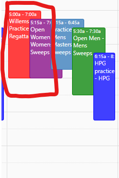
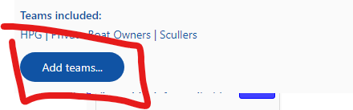
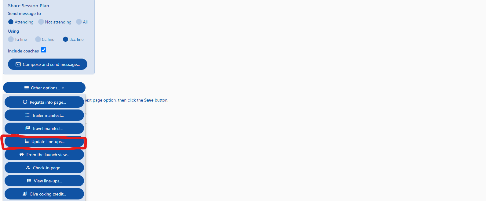
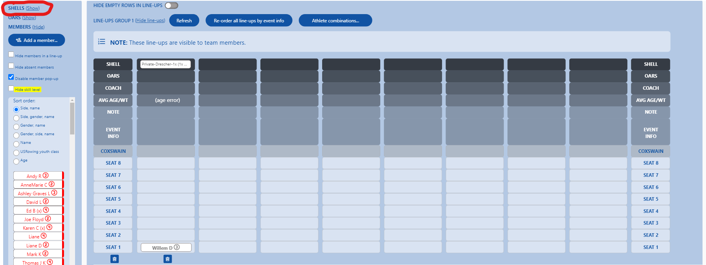
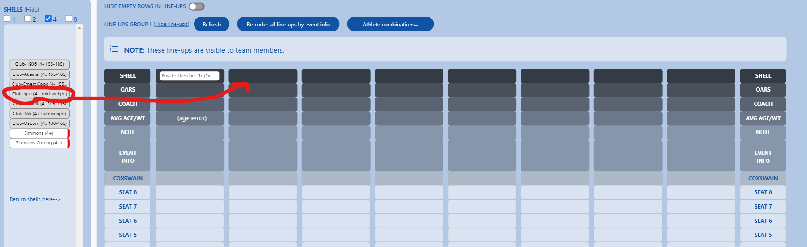
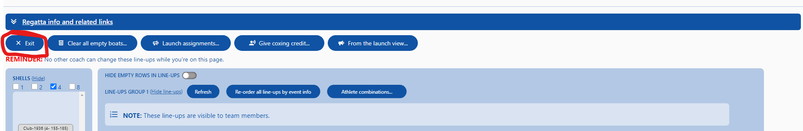
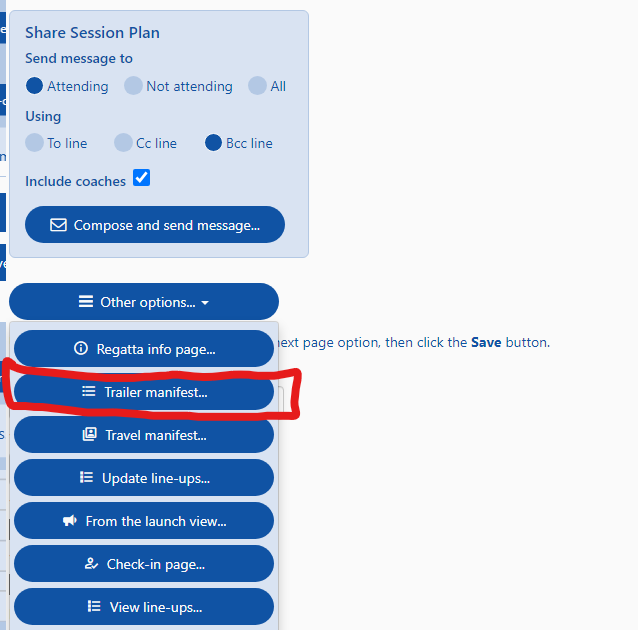
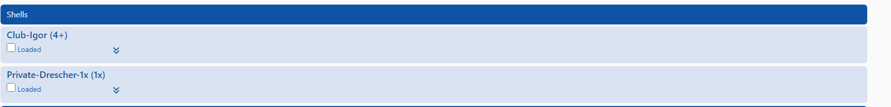
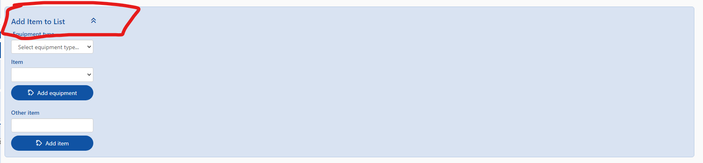

#### Table of contents
* [Regatta Creation](#regatta-creation)
* [Manifest Management](#manifest-management)

welcome to the regattas page

## Regatta Creation

### 1) Click Create Session

### 2) Flip Toggle `Session is a regatta.` to TRUE

### 3) Enter Relevant Details to the form
Make sure to add 

 - [ ] Regatta Name
 - [ ] Regatta ID
 - [ ] Accurate Start and End date

### 4) Hit SAVE

`HIT SAVE`

### 5) Click Regatta Information
To add more regatta specific details you will have to navigate to it's specific page

### 6) Adding Regatta Info
Add as much info here to help communicate days when trailer will be gone and loading/unloading will happen

## Manifest Management
Adding to the manifest is the best way to communicate to trailer drivers/managers what boats need to get to the regatta. This wil add it to a checklist that will be used before trailer leaves RBC and regatta venue

### 1) Click on the session

Click on the regatta session

### 2) Ensure your team is included
Make sure your team is included and add if not:

### 3) Click on update lineups

### 4) Expand shells
Hit `Show`

### 5) Add shells
Drag a shell from the left into the next available column

### 6) Add All Shells
Confirm shell choices then hit `Exit`

### 7) Confirm shells are in manifest
Hit `Update line-ups`

### 8) Confirm shells are in manifest
Verify manifest

### 9) Add Misc Equipment
Expand `Add Item to List`

Then add specific item to manifest

