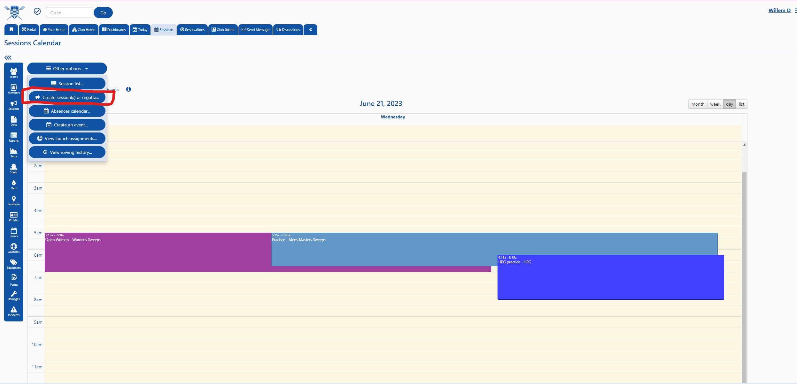
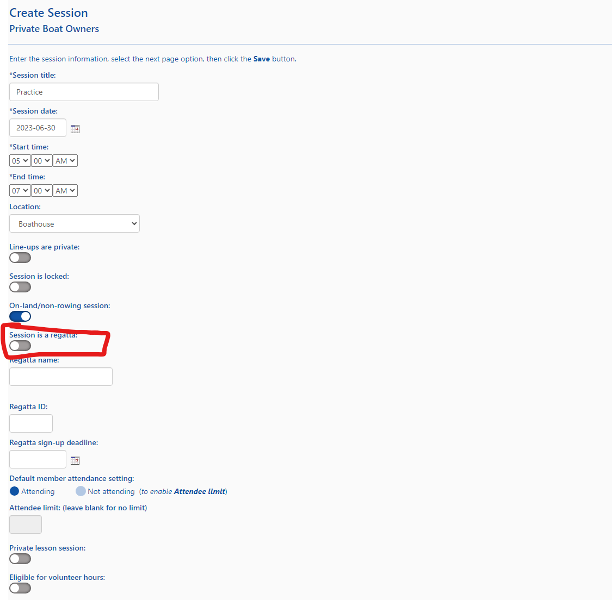
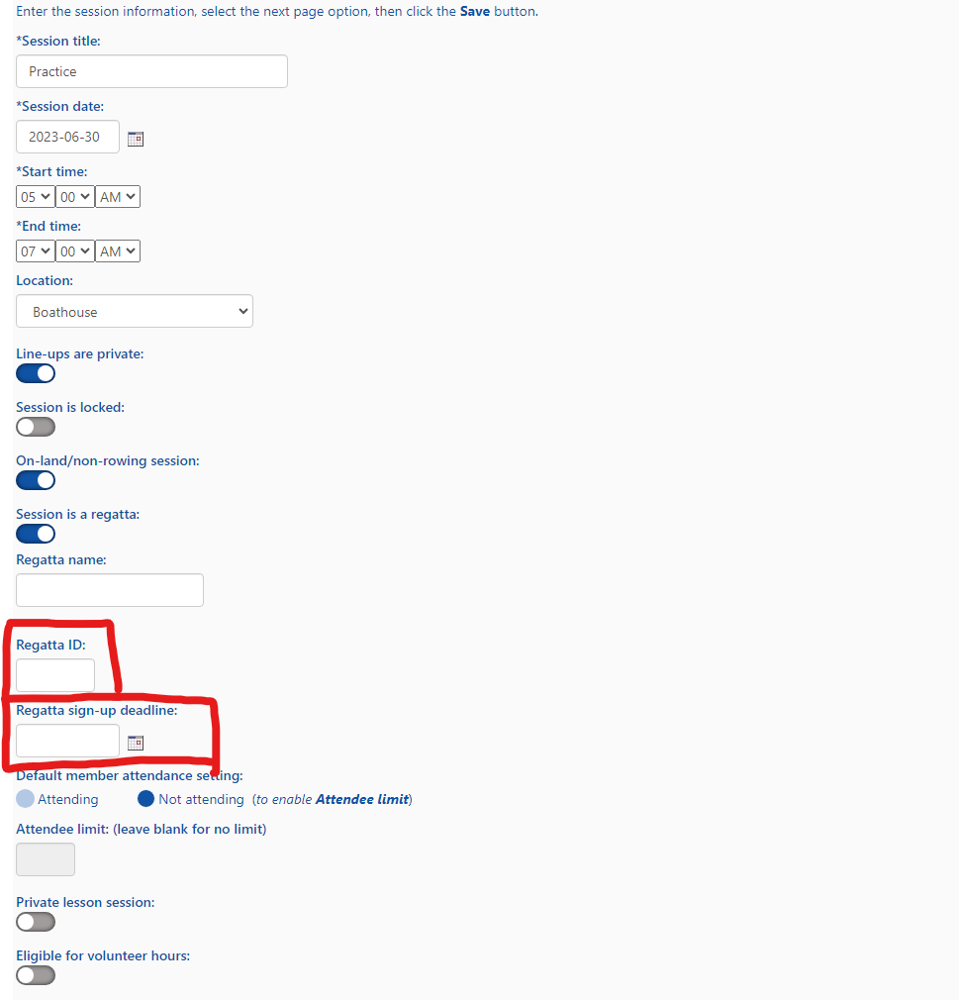
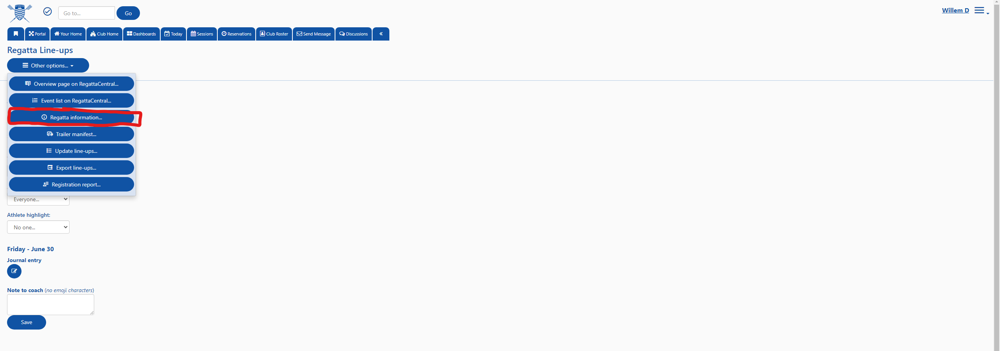
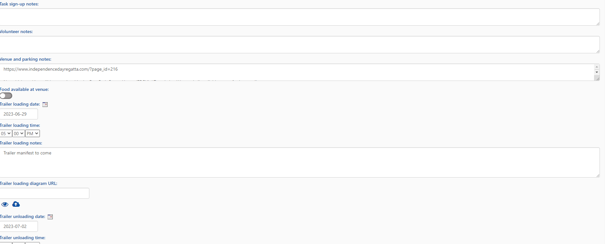

## Regatta Creation

### 1) Click Create Session

### 2) Flip Toggle `Session is a regatta.` to TRUE

### 3) Enter Relevant Details to the form
Make sure to add 

 - [ ] Regatta Name
 - [ ] Regatta ID
 - [ ] Accurate Start and End date

### 4) Hit SAVE

`HIT SAVE`

### 5) Click Regatta Information
To add more regatta specific details you will have to navigate to it's specific page

### 6) Adding Regatta Info
Add as much info here to help communicate days when trailer will be gone and loading/unloading will happen

