## Reserving a Shell

### 1) Click Club Menu

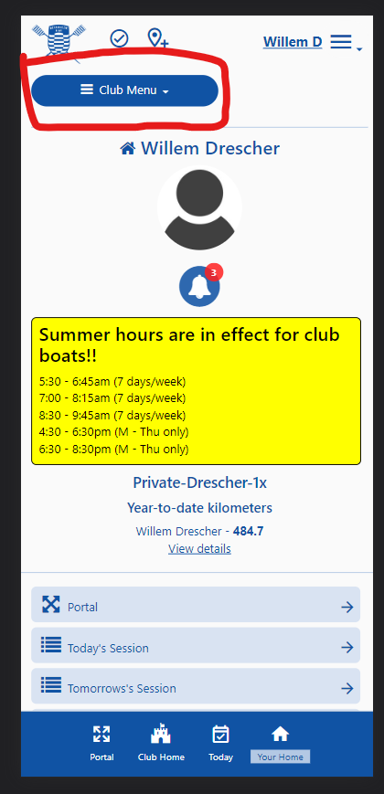

### 2) Click `Reservations`

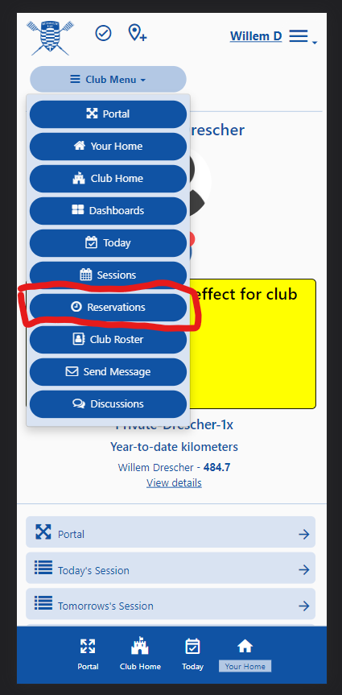

### 3) Click `Other Options`

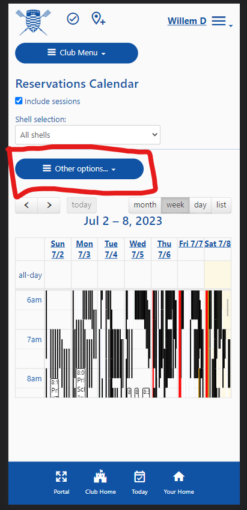

### 4) Click `Reserve a Shell..`

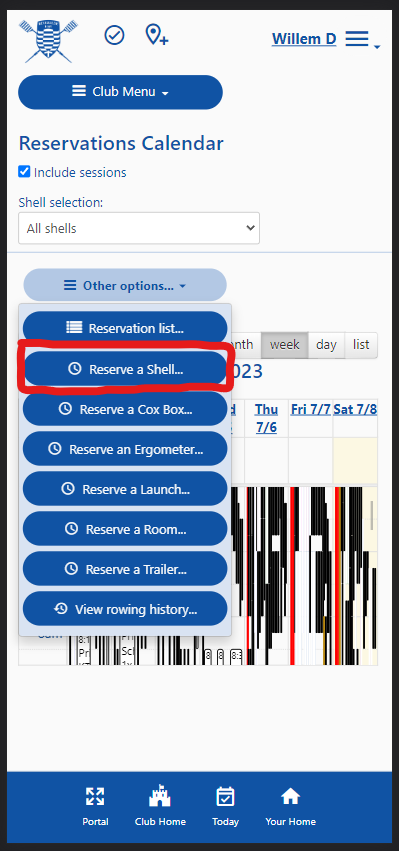

### 5) Optionally Click `Come here after logging on`

This will bring you right to reservations every time you login from your phone

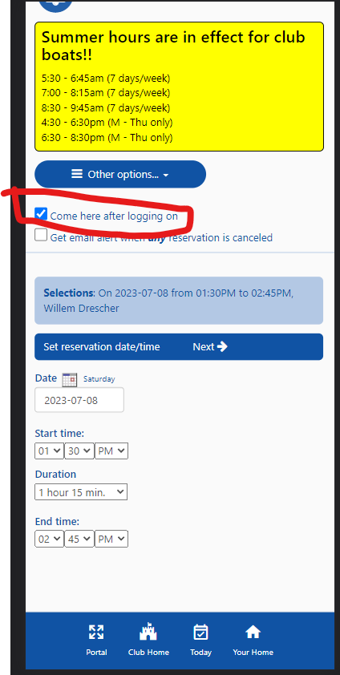

### 6) Set appropriate date and time

If you are rowing immediately, the time will be set to the next closest time slot

If not, you should set an accurate time. Observe the time slots for RBC club boat usage
```
5:30 - 6:45am 
7:00 - 8:15am 
8:30 - 9:45am 
4:30 - 6:30pm 
6:30 - 8:30pm
```

Reservations can at most be made 3 days out

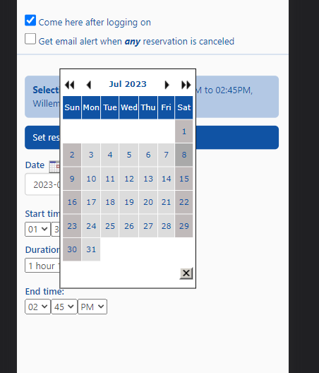

### 7) Hit `Next`

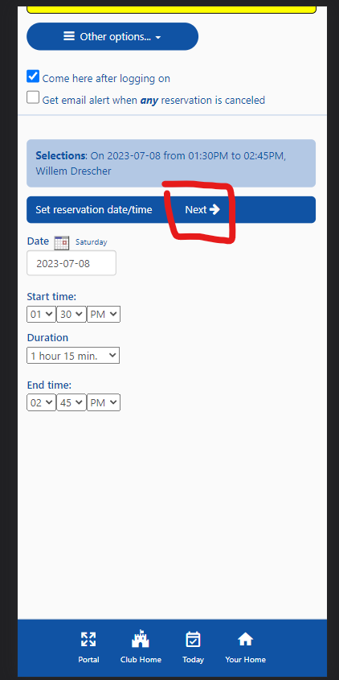

### 8) Set appropriate filters

Boats shown will correlated to your on file captains test level. 
```
Those without L1 will only see peinerts
Those with L1 can see club singles and doubles
Those with L2 can see 4x & 4-
Captains should be able to see their relevant team boats(8's, 4's etc)
```

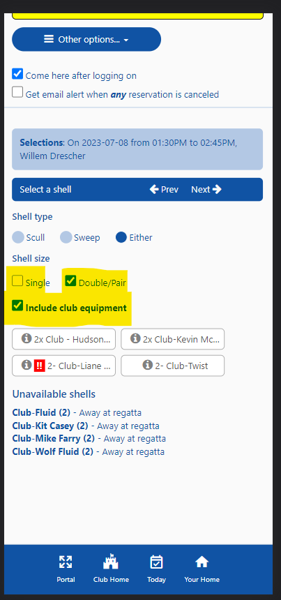

### 9) Click on the desired shell

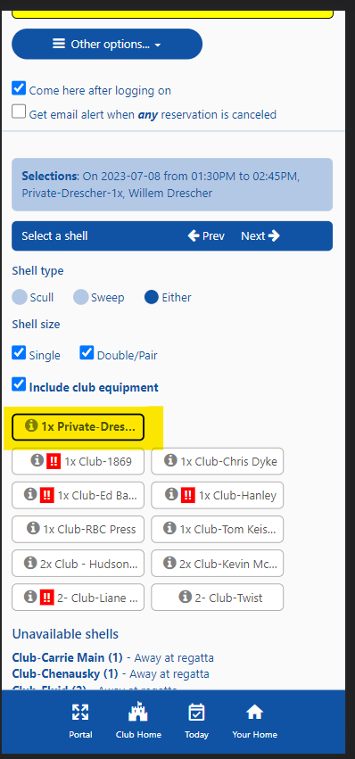

### 10) Note damage indicators

Shells with damage reports will show the `!!` icon in red to the left of the name

Click on the icon to see more `below`

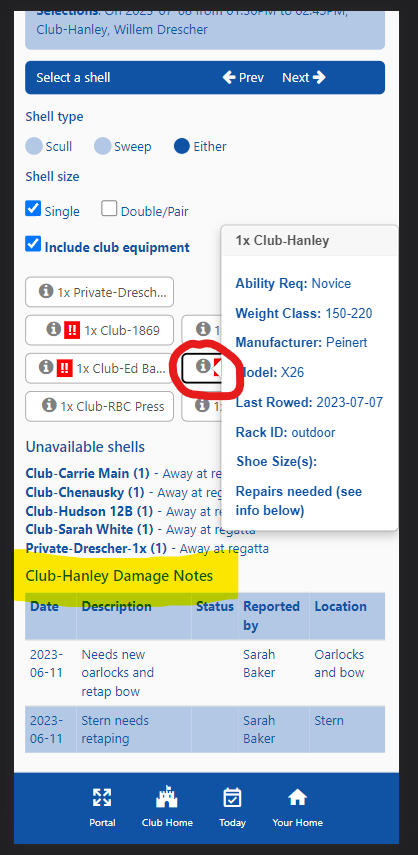

### 11) Click `Next`

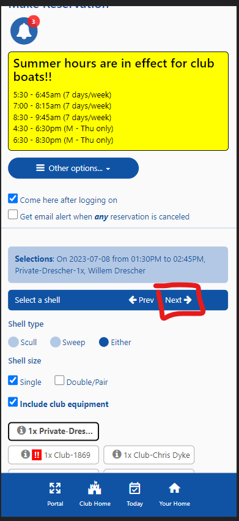

### 12) Click oars

If using club oars please indicate which set

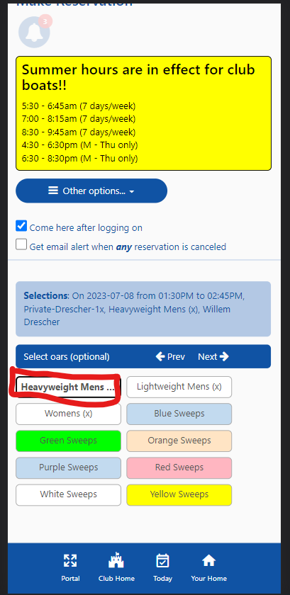

### 13) Click `Next`

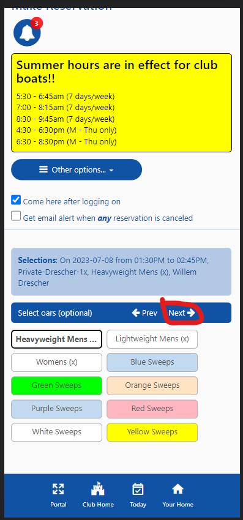

### 14) Make Reservation
Optionally click `Check out onto the water immediately` to check out your boat and go row - otherwise you will have to check out when the reservation begins

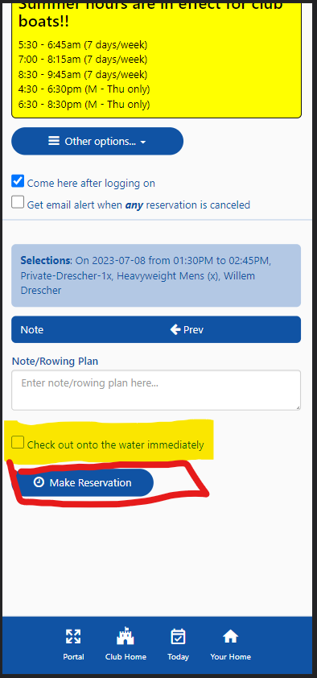

